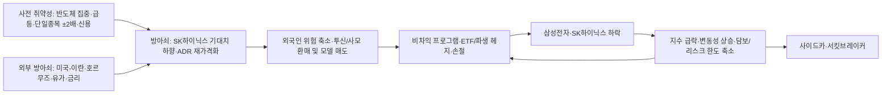

# 2026-07-13 코스피·반도체 폭락: 정치 압박·세력·전쟁·기계적 수급 가설 검증

## 메타

- 리포트 ID: `KR-KOSPI-SEMI-CRASH-CAUSAL-20260713`
- 산출일: 2026-07-13 KST, 정규장 마감 후
- 분석 범위: 코스피, 삼성전자/Samsung Electronics (005930), SK하이닉스/SK hynix (000660), 반도체·단일종목 ±2배 상품, 투자자별·프로그램 수급, 미국-이란 및 호르무즈 리스크
- 분석 목적: 폭락을 `확인된 사실`, `가장 유력한 인과`, `가능하지만 미확인인 가설`로 분리
- 최종 판정: `복합 유동성 쇼크 + 반도체 기대치 조정 + 레버리지·프로그램 증폭`
- 조작 판정: `unproven` — 공개 자료만으로 정치권 압박 또는 공모 시세조종을 입증할 증거 없음
- 기계적 수급 판정: `mechanical_flow_blocked`
- 전략 판정: 사용자 보유·평단·담보비율 미확인으로 개별 매수·매도 지시는 `blocked`, 위험 관리는 `watch_only`
- 주의: 이 문서는 시장 구조 분석 자료다. 특정 상품의 확정 매수·매도 지시나 손실 회복 보장이 아니다.

## 한 줄 결론

오늘 폭락은 ‘주식에서 돈이 전부 빠져나간 단순 약세’도, ‘전쟁 하나만의 충격’도, 현재 확인된 증거상 ‘정치권의 의도적 주가 누르기’도 아니다. 가장 잘 맞는 설명은 **반도체·레버리지로 지나치게 붐빈 시장에 SK하이닉스 기대치 하향과 ADR 이벤트, 중동·유가 위험이 방아쇠를 당겼고, 투신·사모와 비차익 프로그램의 대규모 매도가 하락을 자기강화한 복합 유동성 쇼크**다.

## 오늘 실제로 일어난 일

| 항목 | 2026-07-13 결과 | 해석 |
|---|---:|---|
| 코스피 | 6,806.93, **-8.95%** | 통상 조정이 아니라 시장기능 보호장치가 작동한 충격 |
| 코스닥 | 799.36, **-4.55%** | 코스피보다 낙폭이 작아 대형 반도체 집중 충격을 시사 |
| 삼성전자 | 254,500원, **-10.70%** | 지수 기여도가 큰 대형주 급락 |
| SK하이닉스 | 1,845,000원, **-15.37%** | 실적 기대 하향·ADR 이벤트·포지션 혼잡이 집중 |
| 개인 KOSPI 현물 | **+3조 8,869억원** | 저가매수로 매물을 흡수했으나 가격 방어 실패 |
| 외국인 KOSPI 현물 | **-1조 6,705억원** | 실제 해외 위험 축소가 존재 |
| 기관 KOSPI 현물 | **-2조 2,338억원** | 오늘 하락의 큰 현물 매도 축 |
| 투신·사모 | **-2조 1,361억원** | 기관 매도의 거의 전부를 설명하는 핵심 범주 |
| 연기금 등 | **-662억원** | 기여는 있으나 오늘 폭락의 지배적 원인은 아님 |
| 프로그램 비차익 | **-1조 8,894억원** | 종목선별보다 바스켓·ETF·모델·환매성 매도 정황 |
| 프로그램 차익 | +1,176억원 | 선물-현물 차익거래만으로 하락을 설명할 수 없음 |
| 프로그램 합계 | **-1조 7,718억원** | 기계적·바스켓 매도가 실제 가격 압력으로 작동 |
| 시장조치 | 10:34 매도 사이드카, 13:28 서킷브레이커 | 유동성 고갈과 자기강화 매도 확인 |

시장 데이터는 [네이버금융 KOSPI 일별시세](https://finance.naver.com/sise/sise_index_day.naver?code=KOSPI&page=1), [투자자별 매매동향](https://finance.naver.com/sise/investorDealTrendDay.naver?bizdate=20260713&sosok=), [프로그램 매매동향](https://finance.naver.com/sise/programDealTrendDay.naver?bizdate=20260713&sosok=)의 KRX 연계 마감 스냅숏을 사용했다. 기사별 마감 집계는 분류·갱신 시점에 따라 수십~수백억원 차이가 있을 수 있어, 본 보고서는 위 동일 스냅숏을 일관되게 사용했다.

## 원인 우선순위

| 순위 | 원인 | 기여도 판단 | 근거의 질 | 판정 |
|---:|---|---|---|---|
| 1 | 투신·사모, 비차익 프로그램, ETF·규칙 기반 매도의 동방향 압력 | 매우 큼 | 당일 수급 숫자 | `confirmed` |
| 2 | 반도체 대형주 집중과 레버리지 포지션 혼잡 | 매우 큼 | 지수·종목 낙폭, 상품 구조 | `strong` |
| 3 | SK하이닉스 이익 기대 하향과 ADR 상장 후 재가격화 | 큼 | 증권사 추정치·현지/국내 가격 | `confirmed trigger` |
| 4 | 미국-이란 재격화, 호르무즈·유가·금리 위험 | 중간~큼 | 국제시장 동시 반응 | `confirmed accelerator` |
| 5 | 외국인 위험 축소 | 큼 | 외국인 현물 -1.67조원 | `confirmed` |
| 6 | 연기금 전략적 자산배분 정상화 | 작음~중간 | 정책 배경과 당일 -662억원 | `possible contributor` |
| 7 | 정치권의 의도적 주가 억압 | 확인 불가 | 명령·계좌·통신 증거 없음 | `unproven` |
| 8 | 특정 큰손의 불법 공모 시세조종 | 가능성은 0이 아니나 확인 불가 | 공개 일별 합계로는 의도·공모 식별 불가 | `unproven` |

기여도는 정밀 계량 분해가 아니라 공개된 동시 지표를 이용한 인과 우선순위다. 동일 주문이 기관·프로그램·ETF 통계에 중복 반영될 수 있으므로 금액을 단순 합산하지 않았다.

## 인과 사슬

핵심은 방아쇠와 증폭기를 구분하는 것이다. 전쟁과 실적 추정치는 최초 매도 이유가 될 수 있지만, -8.95%까지 커진 낙폭은 포지션 집중과 기계적 매도 피드백 없이는 설명력이 떨어진다.

## 반도체 자체가 망가진 것인가

그렇게 단정하기 어렵다.

- 한국투자증권은 SK하이닉스 2분기 영업이익을 약 60.4조원으로 보아 당시 컨센서스 65조원보다 약 8% 낮게 추정했고, 2026·2027년 영업이익 추정치를 각각 9%, 11% 내렸다. 이는 ‘이익이 사라졌다’기보다 **주가에 들어 있던 초고강도 기대의 기준선이 낮아진 것**에 가깝다. [연합뉴스 시장 마감 보도](https://v.daum.net/v/20260713160754737)
- 같은 날 대만 TSMC는 +1.04%였지만 일본 키옥시아는 -12.86%였다. 전 세계 반도체가 동일하게 무너진 것이 아니라 메모리·AI 기대가 높은 종목과 시장에서 조정이 더 컸다. [연합뉴스](https://v.daum.net/v/20260713160754737)
- 삼성전자와 SK하이닉스의 지수 비중이 극단적으로 커진 상태라 두 종목의 동시 급락이 코스피 전체를 실제 경제보다 더 나쁘게 보이게 만들었다.
- KB금융, LG에너지솔루션, 삼성바이오로직스처럼 상승한 대형주도 있었다. 따라서 ‘한국 주식 전체에서 돈이 완전히 철수’한 장이라기보다 **외국인·기관의 실제 위험 축소와 비반도체 일부 회전이 동시에 존재**했다. [뉴스1 마감 보도](https://v.daum.net/v/tGvAwHWItZ)

## SK하이닉스 ADR은 왜 중요했나

SK하이닉스 미국 ADR은 나스닥 첫날 공모가 149달러 대비 13.08% 오른 168.49달러에 마감했다. 10 ADR이 국내주식 1주에 대응하고 당시 환율을 적용한 단순 환산가는 약 252만9,700원으로, 국내 종가 184만5,000원보다 약 37% 높았다. [서울신문 ADR 분석](https://www.seoul.co.kr/news/economy/securities/2026/07/14/20260714006001)

이 차이는 두 가지를 동시에 말한다.

1. 해외 투자자가 보는 장기 가치가 국내 종가만큼 붕괴했다고 단정하기 어렵다.
2. 결제·세금·환전·전환 가능성·추가 발행 시점 때문에 즉시 무위험 차익거래가 가능한 가격차가 아니다. 따라서 ADR 프리미엄 자체가 국내주식 즉시 매수 신호도 아니다.

상장 기대가 이미 국내 주가에 선반영된 뒤 실제 상장일이 ‘뉴스에 팔기’ 이벤트가 되었고, 국내와 ADR 사이의 가격발견이 불안정해진 것이 변동성을 키운 것으로 보는 편이 합리적이다.

## 왜 인버스 2배가 올랐다가 현물 2배가 다시 오르나

기초자산이 급락하면 -2배 인버스 가격이 급등하고, 뒤이어 기초자산이 반등하면 +2배 레버리지 가격이 크게 오른다. 이것만으로는 누군가 시장 방향을 번갈아 조종했다는 증거가 아니다. **일일 수익률을 두 배로 추종하는 상품의 정상적인 산술**만으로도 이런 화면이 나온다.

더 중요한 것은 상품의 일일 재설정이다. 시작 순자산을 `V`, 목표 배수를 `L`, 기초자산 일간 수익률을 `r`로 단순화하면 종가 재조정 노출은 대략 `L × V × r × (L-1)` 방향으로 발생한다.

- `L=+2`: 상승 후 노출을 더 사고, 하락 후 노출을 판다.
- `L=-2`: 상승 후 숏 노출을 줄이기 위해 사고, 하락 후 숏 노출을 늘리기 위해 판다.
- 즉 ±2배 모두 큰 방향 움직임 뒤에는 실제 운용·스왑 상대방의 헤지가 **그 방향을 따라가는 주문**이 될 수 있다.

그래서 변동성이 큰 날에는 `하락 → 레버리지·인버스 운용/헤지 조정 → 추가 하락 → 손절·담보 축소`가 가능하다. 다만 상품별로 현물, 선물, 스왑, 장외 헤지 비중이 다르고 당일 설정·환매도 섞이므로, 공개 총계만으로 ‘레버리지 ETF가 정확히 얼마를 팔았다’고 계산할 수는 없다.

금융위원회는 2026년 5월 삼성전자·SK하이닉스 기반 ±2배 단일종목 상품 출시 당시에도 일일 배수, 음의 복리, 큰 손실 가능성과 괴리·변동성 모니터링 필요성을 공식 경고했다. [금융위원회 2026-05-26 자료](https://www.fsc.go.kr/no010101/86973?curPage=2&srchBeginDt=&srchCtgry=&srchEndDt=&srchKey=&srchText=)

오늘 **비차익 프로그램 -1.8894조원**과 **투신·사모 -2.1361조원**은 이런 바스켓·펀드·환매·리스크 모델성 매도와 일치한다. 그러나 이것은 ‘기계적 흐름의 존재’를 강하게 지지할 뿐, 각 주문의 최종 원인이나 불법성을 입증하지는 않는다.

## 전쟁 때문인가

전쟁은 실재하는 방아쇠이자 증폭기지만 단독 원인은 아니다.

- 미국-이란 긴장이 다시 높아지고 이란이 호르무즈 봉쇄를 주장하면서 7월 13일 브렌트유는 약 3%, WTI는 약 2.4% 올랐고 나스닥100 선물은 약 0.9% 하락했다. 미국 장전 SK하이닉스 ADR과 반도체 ETF도 약세였다. [Reuters 미국 선물·반도체](https://www.reuters.com/business/sp-500-nasdaq-futures-decline-us-iran-escalation-rattles-sentiment-2026-07-13/), [Reuters 글로벌시장](https://www.reuters.com/business/media-telecom/global-markets-global-markets-2026-07-13/)
- 국제에너지기구는 7월 7~8일의 재격화가 전망을 다시 흐렸다고 평가했고, 호르무즈는 평상시 세계 석유 소비의 약 20%가 통과하는 핵심 통로다. [IEA 2026년 7월 석유시장 보고서](https://www.iea.org/reports/oil-market-report-July-2026?mode=overview), [IEA 공급차질 설명](https://www.iea.org/news/new-iea-report-highlights-options-to-ease-oil-price-pressures-on-consumers-in-response-to-middle-east-supply-disruptions)
- 미국 에너지정보청도 분쟁 이후 호르무즈 통과량이 크게 줄었으며 선박 위치 자료의 신뢰성도 낮아졌다고 설명한다. [EIA 에너지안보 분석](https://www.eia.gov/outlooks/steo/report/energysecurity/article.php)

그러나 나스닥 선물 약 -0.9%, TSMC +1.04%와 비교해 코스피 -8.95%, SK하이닉스 -15.37%는 지나치게 크다. 이 차이가 바로 **한국의 반도체 집중, 선반영, ADR 이벤트, 레버리지와 펀드 수급**이 추가로 필요하다는 증거다.

## 정치권이 강하게 눌렀다는 가설

### 가능한 경로

- 국민연금 등 공적자금의 국내주식 목표비중 복귀와 리밸런싱
- 규제·세제·지배구조 발언이 특정 업종 위험 프리미엄을 올리는 경우
- 정책기관 또는 국책금융기관의 비공개 주문 지시
- 파생 포지션을 가진 주체와 현물 대량매도 주체의 공모

### 현재 확인된 사실

- 보건복지부는 시장 충격을 이유로 국민연금의 전략적 자산배분 리밸런싱을 2026년 6월 말까지 한시 유예했었다. 유예 종료 뒤 목표비중 정상화는 배경 매물 요인이 될 수 있다. [보건복지부 기금운용위원회 자료](https://www.mohw.go.kr/gallery.es?act=view&b_list=12&bid=0003&cg_code=&keyField=&list_no=380100&mid=a10505000000&nPage=1&orderby=&vlist_no_npage=1)
- 국민연금의 2026년 4월 국내주식 보유액은 419.5조원, 전체 기금의 25.1%였다. 큰 규모인 만큼 정상적 리밸런싱도 시장에 영향을 줄 수 있다. [국민연금 자산별 운용 현황](https://fund.nps.or.kr/oprtprcn/ivsmprcn/getOHED0003M0.do)
- 하지만 오늘 연기금 등은 -662억원이고, 투신·사모는 -2조1,361억원이었다. **오늘 폭락을 연기금 또는 정치 지시 하나로 설명하는 수급 구조가 아니다.**
- 7월 13일 마감 현재 금융위원회·금융감독원·한국거래소가 이 급락을 정치 압박 또는 조직적 시세조종으로 판정했다는 공식 발표는 확인하지 못했다.

### 판정

정책·연기금 리밸런싱이 일부 공급 압력을 만들었을 가능성은 있다. 그러나 이는 공개된 자산배분 규칙에 따른 거래일 수 있고, 오늘 비중도 작다. **정치적 의도를 주장하려면 지시 문건, 통신 기록, 반복적 주문 패턴, 계좌 연계, 파생 이익 포지션 같은 추가 증거가 필요하다.** 현재 판정은 `가능성 배제 불가, 증거 부족`이다.

## 큰손들이 장난칠 수 있나

큰 자금이 합법적으로도 시장을 크게 움직일 수 있고, 불법 시세조종도 역사적으로 실제 존재했다. 하지만 ‘가격이 비정상적으로 많이 빠졌다’와 ‘불법 조종이 입증됐다’는 전혀 다른 명제다.

공개 일별 수급으로 확인할 수 있는 것은 주체 범주와 순매수 금액까지다. 불법성을 입증하려면 다음이 필요하다.

| 확인 항목 | 조종 정황이 강해지는 패턴 | 오늘 공개 자료 상태 |
|---|---|---|
| 계좌 집중도 | 소수 연계 계좌가 반복적으로 종가를 누름 | 미공개 |
| 주문-취소 비율 | 대량 허수주문·레이어링 뒤 반대편 체결 | 미공개 |
| 현물-파생 연계 | 풋·숏을 먼저 쌓고 현물을 가격 무시 대량매도 | 포지션 주체 미공개 |
| 동시호가 | 같은 주체가 마감가격을 반복 왜곡 | 계좌별 자료 미공개 |
| 경제적 이유 | 환매·리밸런싱으로 설명되지 않는 손실 감수 주문 | 미확인 |
| 공모·의도 | 통신·지시·수익 귀속의 연계 | 미확인 |

따라서 지금 말할 수 있는 가장 강한 문장은 **‘대형 자금과 자동화 구조가 폭락을 증폭한 것은 매우 유력하지만, 그것이 불법 공모 또는 정치적 조종이라는 증거는 아직 없다’**이다.

## 역사적으로 실제 있었던 사례

### 한국 2010년 11·11 옵션 쇼크

금융당국 조사에서는 도이치은행 홍콩지점이 풋·합성선물 포지션을 구축한 뒤 장 마감 동시호가에 코스피200 종목 약 2조4,424억원을 저가로 대량 매도해 지수를 2.79% 급락시키고 약 448.8억원의 부당이득을 얻은 현·선물 연계 시세조종으로 판단했다. [금융위원회 2011-02-23 조사 발표](https://www.fsc.go.kr/no010103/24399?curPage=60&srchBeginDt=&srchCtgry=&srchEndDt=&srchKey=&srchText=)

다만 사법 결과는 구분해야 한다. 대법원은 한국 도이치증권 법인과 국내 임원의 공모가 합리적 의심 없이 증명되지 않았다고 보아 무죄를 확정했다. 이는 ‘시장충격 행위가 없었다’는 뜻이 아니라 **관련 법인·임원의 공모와 고의 입증 기준이 매우 높다**는 사례다. [대법원 2024-01-19 공개 자료](https://www.scourt.go.kr/portal/news/NewsViewAction.work?gubun=2&pageIndex=1&searchOption=&searchWord=&seqnum=5207)

### 미국 1987년 블랙먼데이

포트폴리오 인슈어런스의 동적 매도가 하락 때 추가 선물 매도를 부르는 피드백을 만들었다. 연준 연구는 이것을 유일한 원인으로 보지는 않지만 시스템적 자기강화에 기여했다고 평가한다. 현재의 레버리지 ETF·변동성 관리 매도와 구조적 유사성이 있다. [Federal Reserve 연구](https://www.federalreserve.gov/pubs/feds/2007/200713/index.html)

### 미국 2010년 플래시 크래시

대형 매도 프로그램, 고빈도 거래, 유동성 공급자의 철수가 결합하면서 짧은 시간에 가격이 붕괴했다. ‘매도 규모’뿐 아니라 유동성이 사라질 때 자동화 주문끼리 상호작용하는 것이 핵심이었다. [SEC 설명](https://www.sec.gov/news/speech/2010/spch101310geb.htm)

### Archegos 2021

집중된 총수익스왑과 높은 레버리지, 담보요구와 강제청산이 일부 종목을 급락시키고 금융기관에 큰 손실을 냈다. SEC는 이후 조작·기망 혐의도 제기했다. 이는 한 대형 레버리지 주체의 포지션 청산이 시장가격을 실제로 흔들 수 있음을 보여준다. [SEC 2022-04-27 발표](https://www.sec.gov/newsroom/press-releases/2022-70)

오늘 장은 공개 자료상 2010년 한국 사건처럼 특정 계좌의 파생 이익과 종가 대량매도가 확인된 상태가 아니다. 현 단계의 더 적절한 역사적 비유는 **1987·2010형 기계적 피드백에 한국 특유의 반도체 집중과 단일종목 레버리지가 결합한 경우**다.

## ‘자금이 완전히 빠지는 것 같지는 않다’는 느낌의 검증

그 느낌은 절반은 맞고 절반은 틀리다.

- 맞는 부분: 개인이 3.89조원을 순매수했고 일부 대형 비반도체가 상승했으며 코스닥 낙폭도 코스피보다 작았다. 시장 내부의 순환과 저가매수 자금은 남아 있다.
- 틀린 부분: 외국인과 기관이 합계 약 3.90조원을 순매도했고 프로그램도 1.77조원 순매도였다. 대형주 위험 예산은 실제로 크게 줄었다.
- 정확한 표현: **한국 주식에서 자금이 전부 탈출한 것이 아니라, 외국인·기관이 고집중 반도체와 대형주 위험을 줄였고 개인이 그 물량을 떠안는 손바뀜이 일어났다.**

개인 대량 순매수는 바닥 증거가 아니다. 매도 주체가 계속 가격을 낮춰도 개인 순매수 금액은 커질 수 있다. 가격 안정은 ‘누가 받아냈는가’보다 **매도 주체가 멈추고 가격이 VWAP·직전 저항을 회복하는가**로 확인해야 한다.

## 다음 거래일에 원인 가설을 재검증하는 체크포인트

| 시각/항목 | 안정 신호 | 위험 지속 신호 | 의미 |
|---|---|---|---|
| 09:00~10:30 프로그램 | 비차익 매도가 전일 같은 시각 대비 절반 이하, 가격 회복 동반 | 비차익 -5,000억원 이하로 빠르게 확대 | 기계적 매도 재가동 여부 |
| 투신·사모 | 전일 -2.1361조원의 절반 이하로 둔화 | 다시 -1조원 이상 매도 | 환매·펀드 리스크 축소 지속 |
| 외국인 | 삼성전자·SK하이닉스 가격 회복과 함께 순매수 | 순매도 확대, 반등마다 가격 하락 | 해외 위험예산 복귀 여부 |
| 코스피 | 7,000 회복 후 VWAP 위 유지, 이후 7,246 재확인 | 6,806.93 이탈과 프로그램 매도 확대 | 7,000은 심리선, 7,246은 7/8 종가 구조선 |
| 삼성전자 | 254,500원 회복·유지 후 VWAP 상회 | 254,500원 아래 반등 실패 | 대형주 가격발견 안정 |
| SK하이닉스 | 1,845,000원 회복·유지, ADR 괴리 축소 | 국내·ADR 동반 급락 또는 괴리 확대 | ADR 뉴스와 강제매도 분리 |
| 유가·미국 반도체 | 브렌트 77달러 안팎 안정, SOX/나스닥 반도체 진정 | 유가 80달러 재돌파, 미국 반도체 추가 급락 | 외부 방아쇠 지속 여부 |
| 시장조치 | 추가 사이드카 없음 | 재차 사이드카·서킷브레이커 | 유동성 기능 회복 여부 |

숫자는 예측 목표가가 아니라 **가설을 취소하거나 강화할 관찰선**이다. 특히 장초반 10~20분 반등만으로 기계적 매도가 끝났다고 판정하면 안 된다.

## 현재 위험 관리 가이드

- 신규 단일종목 ±2배, 신용·미수, 손실 만회 목적 물타기는 `blocked`다. 변동성이 정상화되지 않은 상태에서 방향을 맞혀도 일일 재설정과 경로 의존성 때문에 손실이 커질 수 있다.
- 현물 보유자는 ‘전량 투매’와 ‘무조건 버티기’ 중 하나를 즉시 고르지 말고, 종목 펀더멘털·평단·비중·필요 현금·담보 위험을 분리해야 한다.
- 담보비율이나 강제청산 가능성이 있으면 가격 전망보다 브로커의 실제 반대매매 조건과 추가 현금 여력이 우선이다.
- 손실이 커서 생활자금·세금·대출상환을 건드리는 상태라면 반등 예측보다 위험 노출 축소 계획이 먼저다.
- 레버리지 없는 장기 현물이라도 반도체 두 종목에 과집중돼 있다면 ‘기업이 좋다’와 ‘포트폴리오가 안전하다’를 분리해야 한다.

개인화된 매수·보유·축소 판단에는 최소한 `종목, 수량, 평균단가, 현물/신용/ETF 구분, 전체 금융자산 대비 비중, 12개월 내 필요 현금`이 필요하다.

## 가정과 한계

- 투자자 분류와 프로그램 수급은 공개 마감 집계이며, 최종수익자·계좌 연계·주문 의도를 보여주지 않는다.
- 비차익 프로그램에는 ETF, 인덱스, 퀀트, 바스켓, 리밸런싱 등이 섞여 있어 전부를 ‘알고리즘 조작’으로 부를 수 없다.
- 상품별 설정·환매, 스왑 상대방 헤지, KOSPI200 선물 계좌 자료가 없어 레버리지 상품의 정확한 충격액을 계산하지 않았다.
- 증권사 이익 추정치는 공식 기업 가이던스가 아니라 분석가 전망이다.
- 전쟁·호르무즈 정보는 진행 중이며 유가·선물·운송량은 다음 거래일까지 크게 바뀔 수 있다.
- ‘공식 조작 발표를 찾지 못함’은 조작이 없다는 증명이 아니다. 조사는 보통 거래소 이상거래 심리와 감독당국 계좌조사를 거쳐 사후에 드러난다.

## 검증 결과

### 인과 검증

| 검증 항목 | 점수 | 결과 | 비고 |
|---|---:|---|---|
| 현재 시장 데이터 최신성 | 98/100 | 통과 | 2026-07-13 마감 후 동일 일자 스냅숏 |
| 투자자·프로그램 수급 분해 | 98/100 | 통과 | 개인/외국인/기관, 기관 세부, 차익/비차익 분리 |
| 전쟁·유가 교차검증 | 96/100 | 통과 | Reuters + IEA + EIA |
| 정치·연기금 가설 검증 | 94/100 | 조건부 통과 | 정책 배경·당일 수급 확인, 계좌/지시 자료 없음 |
| 조작 주장 증거 규율 | 98/100 | 통과 | 사실과 의혹 분리, `unproven` 유지 |
| 레버리지 구조 설명 | 97/100 | 통과 | 일일 재설정과 실제 상품별 한계 명시 |
| 역사 사례 법적 정확성 | 96/100 | 통과 | 당국 조사와 사법 판단 구분 |
| 개인화된 매매 결론 | 72/100 | 차단 | 보유·평단·담보·현금흐름 미확인 |

### 반복 검증 기록

- 1차: 지수·종목 낙폭과 투자자 합계 대조.
- 2차: 기관 세부에서 연기금과 투신·사모를 분리하고 프로그램 차익/비차익을 대조.
- 3차: 국내 촉매를 미국 반도체·유가·IEA/EIA 자료와 교차검증.
- 4차: 정치 압박과 불법 시세조종을 ‘가능한 경로’와 ‘현재 증거’로 분리.
- 최종 데이터 판정: `report_clear`.
- 실제 주문 판정: `blocked_pending_user_portfolio_and_live_orderflow`.

## 출처 레지스트리

- 시장가격·수급: 네이버금융 KRX 연계 일별시세, 투자자별·프로그램 매매동향, 2026-07-13 마감 확인.
- 국내 촉매·시장조치: 연합뉴스, 뉴스1, 서울신문, 2026-07-13~14.
- 단일종목 레버리지 제도: 금융위원회, 2026-05-26.
- 국민연금 리밸런싱·자산현황: 보건복지부, 국민연금기금운용본부.
- 지정학·원유: Reuters, IEA, EIA, 2026-07-13 확인.
- 역사 사례: 금융위원회, 대법원, 미국 연방준비제도, SEC.

