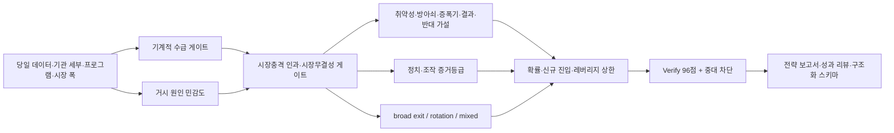

# 주식 전략 오케스트레이터 시장충격 인과·시장무결성 통합 감사

## 메타

- 리뷰 ID: `STOCK-ORCH-CAUSAL-INTEGRATION-AUDIT-20260713`
- 산출일: 2026-07-13 KST
- 대상: `stock_strategy_orchestrator`와 데이터·기계적 수급·거시·레버리지·검증·리포트·리뷰·스키마 경로
- 입력 분석: `funoutput/reports/2026-07-13_kospi_semiconductor_crash_manipulation_flow_analysis.md`
- 요청: 현재 폭락 분석과 방향이 이후 모든 관련 주식 전략에 엄격히 반영되는지 반복 검증하고 개선
- 최종 구조 판정: `integration_clear`
- 실제 시장 원인 판정 상한: 계좌·설정환매·스왑/선물 헤지 자료가 없으면 `conditional_attribution`
- 주의: 구조 검증 통과는 미래 수익, 예측 적중 또는 불법 시세조종의 존재·부재를 보장하지 않는다.

## 감사 결론

기존 오케스트레이터는 기계적 수급, 기관 세부, 프로그램, 사이드카, 단일종목 레버리지, 세계정세와 ADR 선행가격을 이미 상당 부분 다뤘다. 그러나 다음 항목은 전략 생성과 구조화된 검증에서 필수로 강제되지 않았다.

1. 폭락 원인의 `구조적 취약성 -> 방아쇠 -> 증폭기 -> 결과 -> 반대 가설` 분리.
2. 정치 압박·불법 시세조종을 공식 확인, 조사 정황, 공개 수급, 미입증으로 구분하는 증거등급.
3. 기관 합계에서 투신·사모와 연기금을 분리해 정치·연기금 가설의 실제 기여도를 비교하는 규칙.
4. 비차익 프로그램 총계가 특정 레버리지 상품의 정확한 매도액이나 불법 알고리즘을 증명하지 않는다는 귀속 한계.
5. +2배와 -2배 모두의 일일 재설정이 큰 움직임 뒤 같은 방향의 헤지를 만들 수 있다는 양방향 구조.
6. ADR/원주 괴리의 전환·결제·세금·환율·차입 제약.
7. 전쟁·유가·정책을 해외 동종주·다른 지수·시장 폭과 비교하는 반사실 검증.
8. 시장 전체 자금 이탈과 섹터 회전이 동시에 존재하는 `mixed_exit_rotation` 판정.
9. 위 항목을 구조화된 전략 JSON, Verify 카테고리, 성과 리뷰에 저장하는 경로.

이 누락을 신규 상위 게이트, 스키마, 공통 96점 계약, 리포트·리뷰 템플릿, 전용 연결 검증기와 단위 테스트로 보완했다.

## 개선된 조립 경로



신규 게이트는 일반적인 기업 가치평가를 대체하지 않는다. 폭락·세력·정치·조작·전쟁·ADR·±2배 트리거가 있을 때 기계적 수급과 거시 분석을 받아 전략 행동 전에 인과와 증거 수준을 제한한다.

## 핵심 변경

### 신규 시장충격 인과·시장무결성 게이트

- 신규 파일: `funagent/skills/stocks/stock_market_integrity_causal_attribution_skill.md`.
- 적용 트리거: 세력, 장난질, 조작, 정치 압박, 전쟁 단독 원인, 전면 자금 이탈, 사이드카·서킷브레이커, ADR/원주 괴리, ±2배 양방향 급변.
- 판정: `causal_attribution_complete`, `conditional_attribution`, `causal_attribution_unresolved`, `causal_attribution_blocked`.
- 조작 증거등급: `confirmed_official`, `supported_investigative`, `public_flow_only`, `unproven`, `not_assessed`.
- 자금 상태: `broad_exit`, `sector_rotation`, `mixed_exit_rotation`, `unknown`.
- unresolved/blocked에서 신규 진입·물타기·레버리지 강제 차단.

### 기계적 수급·레버리지 보강

- 기관 수급을 금융투자·투신·사모·보험·연기금 등으로 분해.
- 차익과 비차익 프로그램을 분리하고 통계 중복·최종수익자 미확인 한계를 명시.
- 단순 재설정 계산 `L × V × r × (L-1)`을 고정.
- `L=+2, r=+10%`는 +20 매수, `r=-10%`는 -20 매도.
- `L=-2, r=+10%`는 +60 숏 축소 매수, `r=-10%`는 -60 숏 확대 매도.
- 인버스 급등 뒤 레버리지 급등 같은 순차 가격 화면을 조작 증거로 금지.
- 설정·환매·스왑·선물·현물 헤지 자료 없이 정확한 상품별 충격액 산출 금지.

### 거시·전쟁·ADR 보강

- 세계정세를 구조적 취약성, 방아쇠, 증폭기로 분리.
- 해외 동종주·섹터 ETF·다른 국내 지수와 낙폭을 비교하지 않으면 전쟁·유가·정책을 단독 원인으로 승인하지 않음.
- ADR/원주 괴리는 전환비율·환율 외에 전환 가능성, 결제, 세금, 차입, 추가 발행을 확인.
- 실행 제약 미확인 괴리는 가격발견 참고값으로만 사용하고 무위험 차익·즉시 매수 신호로 금지.

### 스키마·템플릿·리뷰 강제

- 신규 구조 스키마: `stock_market_integrity_causal_attribution.schema.json`.
- `stock_strategy_plan.schema.json`에 새 전략 모드와 조건부 필수 패킷 추가.
- `verification_scorecard.schema.json`에 `market_integrity_causal_attribution_suitability` 카테고리 추가.
- `stock_strategy_review.schema.json`에 인과·무결성 사후 리뷰 객체 추가.
- 전략 보고서와 성과 리뷰 템플릿에 동일 인과 계층, 수급 귀속, ADR/반사실 시장, 증거등급 표 추가.
- 공통 Verify 최소 기준은 96점. 필수 트리거에서 96점 미만 또는 중대 차단이 있으면 `진행 가능` 금지.

### 오케스트레이터 조합 강제

아래 6개 조립 경로에 `stock_market_integrity_causal_attribution`을 연결했다.

1. `dual_track_stock_strategy`
2. `short_term_only_strategy`
3. `value_only_strategy`
4. `long_term_total_return_income_strategy`
5. `strategy_review_and_rebuild`
6. `leveraged_3x_tactical_strategy`

## 전략 행동에 미치는 변화

| 상황 | 이전 위험 | 개선 후 강제 행동 |
|---|---|---|
| 개인 대량 순매수·가격 하락 | 저가매수를 바닥으로 오해 | `retail_absorption_risk`, 주도 매도 중단 전 바닥 금지 |
| 연기금 매도 뉴스 | 정치 압박으로 단정 | 투신·사모·연기금 실제 기여액 비교, 증거 없으면 unproven |
| 비차익 프로그램 대량매도 | AI·레버리지 조작으로 귀속 | 바스켓 압력은 인정, 최종 주체·정확액은 unknown |
| 인버스 후 레버리지 급등 | 세력 방향 전환으로 해석 | ±2배 일일 재설정과 기초자산 급락·반등을 먼저 검증 |
| 전쟁·유가 상승과 국내 폭락 | 전쟁 단독 원인 | 해외 동종시장보다 초과 낙폭이면 trigger/amplifier로 제한 |
| ADR 프리미엄 | 국내주식 즉시 저평가 매수 | 전환·결제·세금·환율·차입 제약 확인 전 가격발견 참고만 |
| 일부 섹터 상승·대형주 폭락 | 자금 이탈 없음 또는 전면 탈출 이분법 | `mixed_exit_rotation` 허용 |
| 조작 공식 발표 없음 | 조작 없음으로 확정 | `official_finding_not_found`, 부재 증명 금지 |

## 반복 검증 기록

### 1차 감사: 기존 구조

- 결과: `conditional`, 72/100.
- 강점: 기계적 수급, 기관 세부, 프로그램, 사이드카, 레버리지, 거시 전달 경로가 존재.
- 미달: 인과 계층, 정치·조작 증거등급, ±2배 양방향 구조, ADR 실행 제약, 자금 이탈·회전, 스키마 저장 경로가 필수 아님.
- 수정: 신규 상위 게이트와 96점 계약 설계.

### 2차 감사: 1차 구현 후

- 결과: `conditional_clear`, 94/100.
- 통과: 신규 스킬·조립 순서·템플릿·전용 스키마·연결 검증기·저장소 검증·27개 단위 테스트.
- 역방향 발견: 공통 Verify 문서에는 새 카테고리가 있었으나 `verification_scorecard.schema.json` enum과 성과 리뷰 스키마에 저장 경로가 누락.
- 수정: scorecard enum, review schema, 리뷰 템플릿, 통합 검증기 점검 항목 추가.

### 3차 감사: 스키마 역방향 보완 후

- 결과: `integration_clear`, 98/100.
- 전용 연결 검증: `Stock causal integration validation passed.`
- 전체 저장소 검증: `FunInvestAgent validation passed.`
- 전체 단위 테스트: 28/28 통과.
- JSON 구문 검증: 신규 인과 스키마, 전략 계획, 전략 리뷰, Verify scorecard 모두 통과.
- Git 공백·충돌 표식 검사: 오류 없음. 줄바꿈 변환 경고만 존재하며 내용 오류는 아님.

## 최종 Verify 평점

| 카테고리 | 1차 | 2차 | 3차 | 기준 | 판정 |
|---|---:|---:|---:|---:|---|
| 오케스트레이터 조립 완결성 | 70 | 98 | 100 | 95 | 통과 |
| 시장충격 인과·시장무결성 | 58 | 96 | 100 | 96 | 통과 |
| 기계적 수급·±2배 구조 | 82 | 98 | 100 | 96 | 통과 |
| 정치·조작 증거 규율 | 55 | 96 | 100 | 96 | 통과 |
| ADR·반사실 시장·자금 상태 | 62 | 95 | 98 | 95 | 통과 |
| 스키마·기계 저장 가능성 | 60 | 82 | 100 | 95 | 통과 |
| 템플릿·성과 리뷰 연결 | 72 | 95 | 100 | 95 | 통과 |
| 회귀 검증 자동화 | 50 | 98 | 100 | 95 | 통과 |
| 실제 라이브 주문 귀속 가능성 | 40 | 40 | 40 | N/A | 자료 미제공, 의도적 unknown |

- 구조 절차 점수: 98/100.
- 실제 시장 인과 적중 품질: N/A. 이후 후속 데이터로 검증해야 함.
- 실행 품질: N/A. 사용자 주문·체결 없음.
- 리스크 준수: 구조상 통과, 실제 운용 결과 N/A.
- 최종 판정: `통과`.

98점인 이유는 구조 누락이 아니라 외부 자료 한계다. 상품별 설정·환매와 스왑·선물·현물 헤지 장부, 계좌별 주문·취소·통신 자료는 공개 데이터만으로 확보할 수 없다. 시스템은 이 한계를 점수로 덮지 않고 `conditional_attribution`, `unproven`, `unknown`으로 남기며 신규 레버리지와 과감한 방향 결론을 차단하도록 변경됐다.

## 검증 명령

```powershell
python .\funagent\validators\validate_stock_causal_integration.py --root .
python -m unittest discover -s .\funagent\validators -p "test_*.py"
python .\funagent\validators\validate_output.py --root .
python -m json.tool .\funmemory\schemas\stock_market_integrity_causal_attribution.schema.json
python -m json.tool .\funmemory\schemas\stock_strategy_plan.schema.json
python -m json.tool .\funmemory\schemas\stock_strategy_review.schema.json
python -m json.tool .\funmemory\schemas\verification_scorecard.schema.json
```

## 남은 약점과 운영 규칙

- Python 환경에 범용 `jsonschema` 패키지가 없어 `$ref`까지 포함한 전체 Draft 2020-12 런타임 검증은 수행하지 않았다. 대신 JSON 구문, 필수 필드·조건부 연결·enum·조립 경로를 전용 검증기에서 직접 검사했다.
- 실제 전략 생성 시 계좌별·상품별 비공개 자료가 없으면 100점 인과 판정을 금지한다.
- 후속 공식 조사나 상품 설정·환매 자료가 나오면 기존 보고서를 덮어쓰지 않고 성과 리뷰에서 증거등급과 인과 계층을 갱신한다.
- 구조 통과를 근거로 정치·조작 가설을 확정하거나 미래 수익을 보장하지 않는다.

